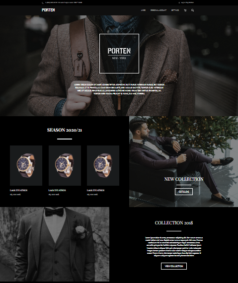
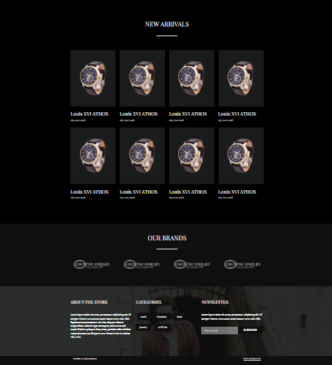

Porten Website — HTML + CSS + Bootstrap
This project is a responsive landing page for a multi-page website of a fictional luxury watch store PORTEN. It includes a full section structure with interactive elements and responsive design for various screen sizes.

🎯 Project Goal
To practice building a modern, visually appealing e-commerce website using semantic HTML, custom CSS, and Bootstrap components. Focus areas include layout structure, typography, interactivity, and adaptability.

🛠️ Technologies Used
HTML5

CSS3 (custom styling)

Bootstrap 5

Google Fonts

JavaScript (for preloader logic)

@media — media queries for responsive design

📁 Project Structure
index.html — main page with full layout

page1.html — additional page

style.css — styles with media queries and custom layout

Folders: Preasure-image/, css/ — adapted images and icons

preview1.PNG, preview2.PNG — project screenshots

📷 Preview

⚙️ Features
Fully responsive layout for screen widths: 1920px, 1200px, 960px, 760px, 470px, and 360px

Page loading animation (preloader)

Hover effects on buttons and products

Bootstrap carousels for sliders and mobile versions

Media queries for mobile adaptability

Visually attractive structure with dark background and graphics

👩‍💻 Author
Veronika Pavuk 
